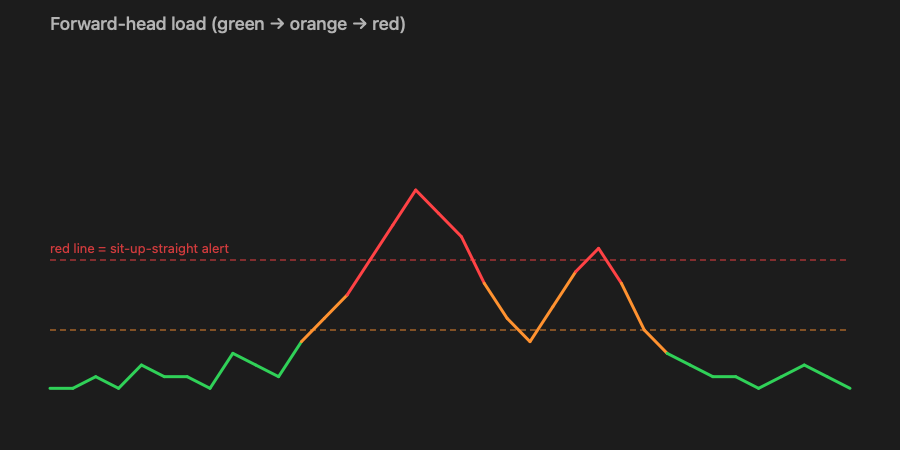
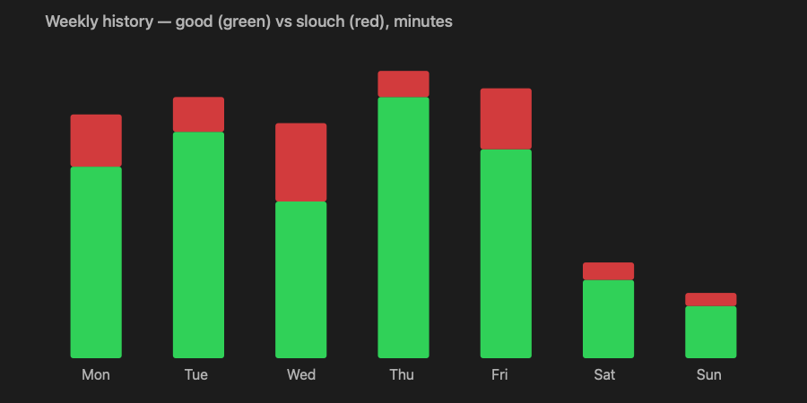

# 🐔 Chicken Neck

A macOS menu-bar app that watches your posture through the Mac's webcam and calls you out, like a tiny orthopaedic chicken on your shoulder, the moment your neck starts craning toward the screen.

Everything runs **on-device** with Apple's Vision framework. **No video is ever recorded, saved, or sent anywhere.**



---

## Why a webcam (and not earbuds)?

I started noticing that I wasn't sitting straight and wasn't keeping my neck straight. While researching it, I saw one of the devs ([chandansgowda]) build a posture nudger using **AirPods**, which works because AirPods pack an **IMU** (motion sensor) that Apple exposes to apps via `CMHeadphoneMotionManager`. As an Android fan, I tried to recreate it with my **Samsung phone and OnePlus buds**, and it didn't work out: the **OnePlus Buds 4 have no motion sensor** at all (only the Buds Pro line ships an IMU), and even if they did, macOS can't read non-Apple earbud sensors.

So I built it with the **webcam** by default instead. Chicken Neck gets the same outcome a different way: it watches your head and neck through the Mac's camera. No special earbuds, no IMU, works with any Mac.

---

## What it tracks (neck-focused, like a physio would)

| Signal | What it means | How it's shown |
|---|---|---|
| **Forward head** ("tech neck") | Head drifting in front of your shoulders or looking down, the main cause of neck strain | Graded green, orange, red, plus the alert |
| **Side tilt** | Leaning your head toward one shoulder (asymmetric loading) | Highlighted with a left/right marker |
| **Rotation** | Craning to a side monitor | Highlighted when sustained |
| **Screen proximity** | Leaning in too close | Folds into the forward-head score |

### The traffic light

Forward-head load is the headline number, graded against two lines:

- **Green:** good posture
- **Orange** (load 6 or more): drifting forward, gentle warning
- **Red** (load 12 or more): sit up straight. This is the one that nudges you.

The live chart colours **by value, not current state**, so a spike into the red zone is drawn red and *stays red* on the 60-second chart, giving you an honest history of how your neck behaved.

> Thresholds are adjustable in **Settings, Forward sensitivity**. If alerts fire when you sit up instead of forward, flip **Reverse forward detection**.

---

## Alerts

When your neck is out of line past the **hold time** (default 3s), Chicken Neck nudges you and **keeps nudging every 20s** while you stay slouched (not just once, and adjustable via **Alert cooldown**).

Three independent channels:

- **On-screen popup banner** (on by default): Chicken Neck draws its **own** floating banner near the top of the screen. This works **without any notification permission**, which matters because locally-built (ad-hoc-signed) Mac apps can't reliably register with macOS Notification Center. Duration is configurable (**"Popup stays for"**, 2 to 15s).
- **Sound cue:** a system sound (pick which one, with a preview button).
- **Spoken cue:** a short voice prompt ("Keep your neck straight").
- **System notifications:** also posted to Notification Center *if* it happens to be authorised (best-effort fallback).

There's a **Test alert** button in Settings to confirm everything fires.

---

## Wellness reminders

Desk workers forget the basics, so Chicken Neck has a **Wellness reminders** dropdown in Settings. These fire on an **always-on timer, even when you're not monitoring or calibrated** (they don't need the camera), so they pop up whenever the app is open. Each is toggleable with its own interval:

| Reminder | Default | Why |
|---|---|---|
| **Drink water reminder** 💧 | every 60 min | people forget to hydrate |
| **Rest your eyes (20-20-20)** 👀 | every 20 min | look about 20 ft away for 20s to relax eye strain |
| **Coop breaks** (stand and stretch) | every 30 min | movement matters even with perfect posture |
| **Lunch reminder** 🌽 | once, 1 to 2pm | skipped meals |

The posture, coop, and lunch reminders keep their playful chicken names; the health reminders use plain language.

---

## Sit-time tracking

While monitoring, Chicken Neck tracks how long you've been at the desk:

- **On the perch:** continuous sitting time since you last got up
- **Seated today:** total for the day
- **Coop breaks:** breaks taken (it detects when you leave the frame for 30s or more and counts that as standing up, resetting the streak)

---

## History and export (Daily, Weekly, Monthly)

The **History** section has a **Daily / Weekly / Monthly** toggle that re-buckets your posture data:

- **Daily:** last 7 days
- **Weekly** (week-over-week): last 8 weeks
- **Monthly** (month-over-month): last 6 months



Each bar shows **good posture (green)** vs **slouch time (red)** in minutes, plus an overall good-posture percentage.

### Downloading your data

Two export buttons, both respecting the selected Daily / Weekly / Monthly range:

- **Export CSV:** saves `Period, Good minutes, Slouch minutes, Good %` rows. Open in Excel or Google Sheets to do your own analysis (pivot day-to-day, week-over-week, or month-over-month).
- **Save graph:** exports the current chart as a **PNG** image.

So to download, say, your **month-over-month** trend: switch the toggle to **Monthly**, then click **Export CSV** (for the numbers) or **Save graph** (for the image). A standard macOS save dialog lets you choose where it goes.

---

## Battery and heat optimization

The camera is the only meaningful power cost, so it's tuned to stay cool:

- **Low-resolution capture** (352x288): plenty for face geometry, about 3x fewer pixels than VGA.
- **Camera capped to about 15 fps** so the system isn't handing us (then discarding) 30 fps buffers.
- **Vision throttled to about 8 fps:** frames in between are discarded *before* any detection runs.
- **Face detection only:** no heavier body-pose model.
- **Idle is 0% CPU** when monitoring is stopped; only the lightweight 1-second wellness timer ticks.
- The menu-bar icon is a plain AppKit `NSStatusItem` rather than SwiftUI's `MenuBarExtra`, which avoided a 100%-CPU scene-rebuild loop on macOS 26.

Net result: live neck tracking with a small, steady footprint instead of a hot, fan-spinning camera session.

---

## Privacy

- 100% **on-device**: Apple Vision runs locally.
- **Nothing is recorded, stored, or transmitted.** Frames are analysed in memory and discarded.
- The only data saved is your aggregate daily stats (minutes good and slouch), in local `UserDefaults`.

---

## Build and run

Requires **macOS 14+** and the Swift toolchain (Xcode or Command Line Tools).

```bash
make run        # build + launch
make install    # copy to /Applications
make uninstall  # remove from /Applications

# regenerate assets
swift scripts/make_icon.swift           # app icon
swift scripts/make_readme_images.swift  # README charts
```

On first launch, grant **camera access** when prompted. Then:

1. **Start monitoring**
2. Sit tall, then **Calibrate**
3. Slouch, tilt, or crane and watch the chicken react.

The menu-bar chicken and the dashboard window both control the app. Toggle the menu-bar icon off in Settings if you prefer the window only.

---

## Settings reference

Forward sensitivity, side-tilt sensitivity, hold before alert, alert cooldown (repeat interval), **Wellness reminders** (water, eyes, coop breaks, lunch, each with interval), on-screen popup alerts plus duration, sound / spoken / system-notification cues, test alert, show menu-bar chicken, reverse forward detection, start at login.

---

## Project layout

```
Sources/ChickenNeck/
  ChickenNeckApp.swift       App entry: dashboard Window + delegate
  AppDelegate.swift          Menu-bar NSStatusItem, popup + notification setup
  PostureCameraService.swift Camera + Vision face tracking (throttled)
  PostureAnalyzer.swift      Calibration, smoothing, green/orange/red grading
  AppState.swift             View-model: pipeline, sit-time, reminders, settings
  AlertManager.swift         Sound / voice / popup / notification cues
  PopupAlert.swift           Self-drawn on-screen banner
  HistoryStore.swift         Daily/weekly/monthly aggregates + persistence
  Export.swift               CSV + PNG export, reusable history chart
  MenuContentView.swift      The dashboard UI
  ChickenIcon.swift          Hand-drawn chicken (menu bar + app icon)
```

---

## Credits

Inspired by [chandansgowda/posture-fix](https://github.com/chandansgowda/posture-fix), which does the same idea using the AirPods IMU. Chicken Neck reworks that concept for the webcam so it runs on any Mac without special earbuds. Thanks to that project for the spark.

---

Built by **Sumanth Raj Urs + Claude**.
